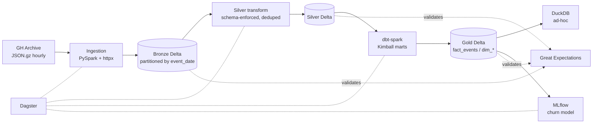

# GHArchive Lakehouse

Open-source lakehouse over the public [GH Archive](https://www.gharchive.org/)
dataset (GitHub events since 2011, ~6B+ events, hourly JSON.gz). Implements a
medallion architecture (Bronze / Silver / Gold) with Delta Lake, SQL
transformations with dbt, asset-based orchestration with Dagster, and quality
observability with Great Expectations.

## Architecture



Full description: [docs/architecture.md](docs/architecture.md). Hosted docs:
**https://dixonalexmg.github.io/gharchive-lakehouse/**.

## Stack

- Python 3.11, PySpark 3.5, Delta Lake 3.x
- dbt-core 1.x + dbt-spark
- Dagster 1.x (assets)
- Great Expectations 1.x
- DuckDB (ad-hoc on Delta), MLflow 2.x
- pytest, ruff, mypy
- Docker Compose, GitHub Actions

## Layout

```
src/
  ingestion/        Bronze: download + JSON parse + Delta write
  transformation/   Silver: clean, normalize, schema enforcement
  quality/          Great Expectations suites and checkpoints
  ml/               Feature engineering + churn model + MLflow
  benchmarks/       Performance benchmark suite
dbt/                Gold dimensional model (Kimball)
dagster_project/    Dagster assets / schedules / sensors
gx/                 Great Expectations project
tests/              pytest unit + integration
docs/               architecture, performance
```

## Getting started

```bash
make setup            # uv sync + docker compose up -d
make ingest YEAR=2024 MONTH=01
make silver
make gold
make test
```

## Common commands

| Command | Description |
| --- | --- |
| `make setup` | Install deps with `uv` and start the docker-compose stack |
| `make install` | `uv sync --all-extras` only |
| `make lint` | Ruff (check + format check) |
| `make format` | Ruff format + autofix |
| `make type` | Mypy strict on `src` |
| `make test` | Pytest with coverage (target >= 80%) |
| `make ingest YEAR=YYYY MONTH=MM` | Backfill Bronze for one month |
| `make silver` | Run Bronze -> Silver |
| `make gold` | `dbt deps && dbt run && dbt test` |
| `make gx` | Run Great Expectations checkpoints |
| `make ml-train` | Train churn model and log to MLflow |
| `make benchmark` | Run performance benchmarks |
| `make dagster-dev` | Start Dagster UI on `:3000` |
| `make docker-up` / `docker-down` | Manage local services |

## Services (docker-compose)

| Service | Port | Purpose |
| --- | --- | --- |
| spark-master | 7077 / 8080 | Spark cluster |
| spark-worker | -- | Spark worker |
| minio | 9000 / 9001 | S3-compatible object store |
| postgres | 5432 | MLflow / Dagster metadata backend |
| mlflow | 5000 | Experiment tracking UI |

## Features

### Bronze ingestion (`src/ingestion/gharchive.py`)

- Generates hourly URLs for any day or month following the GH Archive
  convention `YYYY-MM-DD-H.json.gz` (unpadded hour).
- Concurrent downloads with `httpx.AsyncClient`, bounded by a semaphore,
  exponential backoff on transient failures, atomic `*.part` rename, and
  resume-on-rerun (existing files are skipped).
- Reads JSON.gz with `spark.read.json` and lands a Delta table partitioned
  by `event_date` at `${LAKE_BRONZE}/bronze_gharchive_events/`.
- CLI: `make ingest YEAR=2024 MONTH=01`.
- Dagster asset `bronze_events` with `DailyPartitionsDefinition` so backfills
  are run per-day from the Dagster UI.

Tunable via env (`.env.example`):

| Variable | Default | Purpose |
| --- | --- | --- |
| `GHARCHIVE_BASE_URL` | `https://data.gharchive.org` | Source host |
| `GHARCHIVE_RAW_DIR` | `./data/raw` | Local cache for downloaded `.json.gz` |
| `LAKE_BRONZE` | `./data/bronze` | Delta lake root |
| `GHARCHIVE_CONCURRENCY` | `8` | Max in-flight downloads |
| `GHARCHIVE_TIMEOUT_S` | `60` | Per-request timeout |
| `GHARCHIVE_RETRIES` | `3` | Per-URL retry budget |

### Silver transformation (`src/transformation/silver.py`)

- Reads Bronze, projects a flat **canonical schema** (typed `event_id`,
  flattened actor/repo, JSON-serialized `payload`) and enforces it on
  write — no `mergeSchema` on the way out.
- Drops rows missing the natural key and **deduplicates** by `event_id`
  keeping the latest `_ingested_at` (handles GH Archive replays).
- Writes Delta partitioned by `event_date` to
  `${LAKE_SILVER}/silver_gharchive_events/`.
- CLI: `make silver` (full overwrite) or
  `python -m src.transformation.run --mode append --date 2024-01-15`.
- Dagster asset `silver_events` shares the daily partition definition with
  Bronze for symmetric backfills.

### Gold dimensional model (`/dbt`)

Kimball-style marts built with **dbt-spark** on Delta. Local runs use the
`session` adapter so no Thrift Server is required (`make gold` boots a
Delta-aware Spark session, then invokes `dbt build` in-process).

| Model | Materialization | Purpose |
| --- | --- | --- |
| `stg_events` | view | Pass-through projection over Silver |
| `dim_repo` | table | Repo dimension + cumulative engagement metrics |
| `dim_actor` | table | Actor dimension + activity rollups |
| `dim_date` | table | Calendar dimension over observed event dates |
| `fact_events` | table (partitioned by `event_date`) | Event-grain fact |

dbt tests (uniqueness, not-null, referential integrity) run on every
`make gold`.

### Quality (`src/quality/`)

Per-layer Great Expectations 1.x suites validated against the live Delta
tables. `make gx` runs Bronze, Silver and Gold checkpoints (skipping any
layer that hasn't been materialized yet) and exits non-zero on failure so
CI can gate on it. Each layer is a fresh ephemeral GX context — no
persisted YAML to keep in sync.

### Performance benchmarks (`src/benchmarks/`)

Three benchmark scenarios with deterministic synthetic data:

- **Partition pruning** — partitioned vs flat scan filtered by `event_date`.
- **Z-Order** — `OPTIMIZE … ZORDER BY repo_id` vs unoptimized point lookup.
- **Broadcast join** — `F.broadcast(dim)` vs default shuffle join.

`make benchmark` prints a markdown table; pass `--output docs/performance.md`
to append to the perf log.

### ML — repo churn (`src/ml/`)

Per-repo features over Gold (`fact_events`) and a SparkML
`LogisticRegression` predicting whether a repo goes silent in a holdout
window. Params, metrics (`accuracy`, `roc_auc`, `churn_rate`) and the
fitted pipeline are logged to MLflow under `MLFLOW_EXPERIMENT_NAME`.

Run:

```bash
make ml-train  # uses defaults, you'll typically pass --split-date directly:
uv run python -m src.ml.train --split-date 2024-02-01 --min-events 10
```

### Cross-platform validation (`/notebooks`)

`notebooks/01_silver_to_gold_validation.py` is a Databricks-format notebook
that mirrors the dbt SQL inline as Spark SQL. Runs unchanged on **Databricks
Community Edition** (set the `silver_path` widget to a DBFS path) and
locally (uses `SILVER_PATH` env var). Acts as an executable spec — any
divergence between it and `/dbt/models` is a regression.

## Metrics & screenshots

| Metric | Value |
| --- | --- |
| Layers materialized | Bronze, Silver, Gold (`fact_events`, `dim_repo`, `dim_actor`, `dim_date`) |
| Test coverage target | ≥ 80 % on `/src` (CI gates on it) |
| Quality gates | dbt tests on Gold + Great Expectations on Bronze/Silver/Gold |
| CI jobs | lint · tests · GX checkpoints (each uploads its artifact) |
| E2E test | 30 days × 4 hours synthetic data, full Bronze → Silver + GX |
| Image | `ghcr.io/dixonalexmg/gharchive-lakehouse:latest` (built on tag push) |

### Dagster UI

Boot the UI with `make dagster-dev` and capture three views into `docs/img/`:

| File | What to capture |
| --- | --- |
| `docs/img/dagster-assets.png` | Asset graph view (`bronze_events` → `silver_events` → `gold_marts` → `quality_checkpoints` + `churn_model`). |
| `docs/img/dagster-runs.png` | Runs page after a successful daily backfill (one green row per partition). |
| `docs/img/dagster-asset-detail.png` | `silver_events` asset detail with materialization metadata + partition status. |

Then reference them inline:

```md


```

## Releasing

Tag the commit with `vMAJOR.MINOR.PATCH` and the `release` workflow builds
the Docker image and pushes it to GHCR with `latest`, `vX.Y.Z`, `vX.Y` and
`{{version}}` tags:

```bash
git tag v0.1.0
git push origin v0.1.0
```

Or trigger `Release` from the Actions tab manually.

## Documentation

- [Architecture](docs/architecture.md)
- [Performance](docs/performance.md)
- [LinkedIn insights](docs/linkedin-insights.md)
- Hosted (MkDocs Material → GitHub Pages): https://dixonalexmg.github.io/gharchive-lakehouse/
