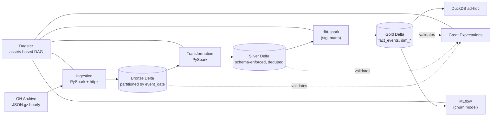

# Architecture



## Layers

### Bronze — raw, faithful

Hourly GH Archive dumps, parsed with `spark.read.json`, landed as Delta and
partitioned by `event_date`. Schema is **inferred** — Bronze is the
untrusted boundary; we don't reshape it.

Path: `${LAKE_BRONZE}/bronze_gharchive_events/`.

### Silver — schema-enforced, deduped

Reads Bronze, projects a flat canonical schema (typed `event_id`, flattened
actor/repo, JSON-serialized `payload`), drops rows missing the natural key,
and deduplicates by `event_id` (keeping the latest `_ingested_at` to absorb
GH Archive replays). Written with **`mergeSchema=false`** — schema drift is
caught here, not propagated downstream.

Path: `${LAKE_SILVER}/silver_gharchive_events/`.

### Gold — Kimball dimensional model

Built declaratively in dbt-spark on top of Silver:

- `fact_events` — event-grain fact partitioned by `event_date`.
- `dim_repo` / `dim_actor` — Type-1 dimensions with cumulative metrics.
- `dim_date` — calendar dimension generated from observed event dates.

Path: `${LAKE_GOLD}/<model_name>/`.

## Orchestration

Dagster assets mirror the medallion DAG:

```
bronze_events  (DailyPartitions)  →  silver_events  (DailyPartitions)
                                         ↓
                               gold_marts (whole dbt build)
                                         ↓
                  ┌──────────────────────┴──────────────────────┐
       quality_checkpoints                              churn_model
       (GX per layer)                                   (MLflow tracking)
```

## Quality

Each layer has a Great Expectations 1.x suite covering its load-bearing
invariants — natural keys, type membership, partition column presence.
The runner uses ephemeral GX contexts, so suites live in code (not in
`gx/expectations/*.json`) and travel with the project.

## Compute model

Local development uses one PySpark process with Delta extensions; dbt-spark
runs against the same in-process session via the `session` adapter, so a
Spark Thrift Server is not required outside production.
