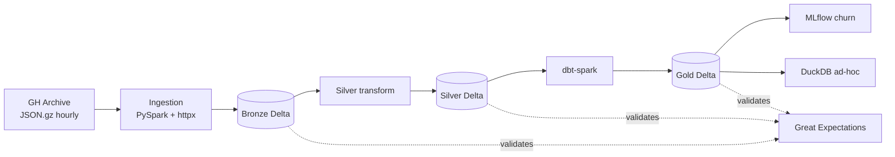

# GHArchive Lakehouse

Open-source lakehouse over the public [GH Archive](https://www.gharchive.org/)
dataset — GitHub events since 2011, ~6B+ events, hourly JSON.gz. Implements a
medallion architecture (Bronze / Silver / Gold) with Delta Lake, SQL
transformations with dbt, asset-based orchestration with Dagster, and quality
observability with Great Expectations.

## At a glance



## Quickstart

```bash
make setup
make ingest YEAR=2024 MONTH=01
make silver
make gold
make test
```

## Sections

- [Architecture](architecture.md) — medallion layers, schemas and orchestration.
- [Performance](performance.md) — partitioning / Z-order / broadcast benchmarks.
- [LinkedIn insights](linkedin-insights.md) — three takeaways worth sharing.

## Source

GitHub: [Dixonalexmg/gharchive-lakehouse](https://github.com/Dixonalexmg/gharchive-lakehouse)
